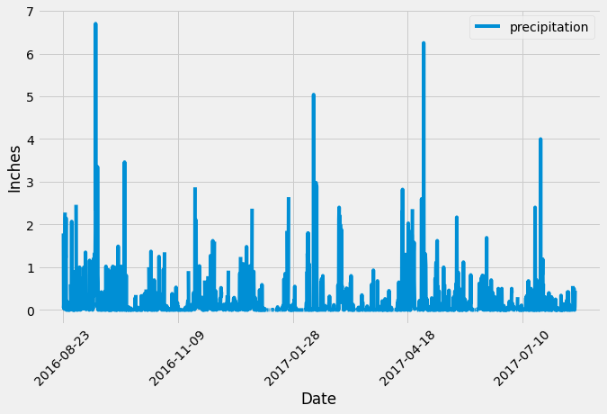
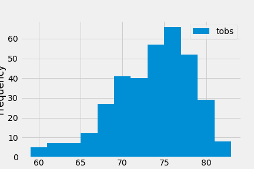

# sqlalchemy-challenge

**Climate Analysis and Exploration**  
  -Precipitation analysis  
    - Designed a query to retrieve the past 12 months of precipitation data.    
    - Selected only date and precipitation values.  
    - Loaded the qury results into a Pandas dataframe and set the index to the column.  
    - Sorted the dataframe by date.  
    - Plotted the results using dataframe plot.  
  

  -Station analysis  
    - Designed a query to calculate the most active stations.  
    - Designed a query to retrieve the last 12 months of temperature observation data (TOBS).  
 

**Climate App**
  - Used Flask to create an API based on the queries I developed above.  
  - Created six different routes with various data queries.  
